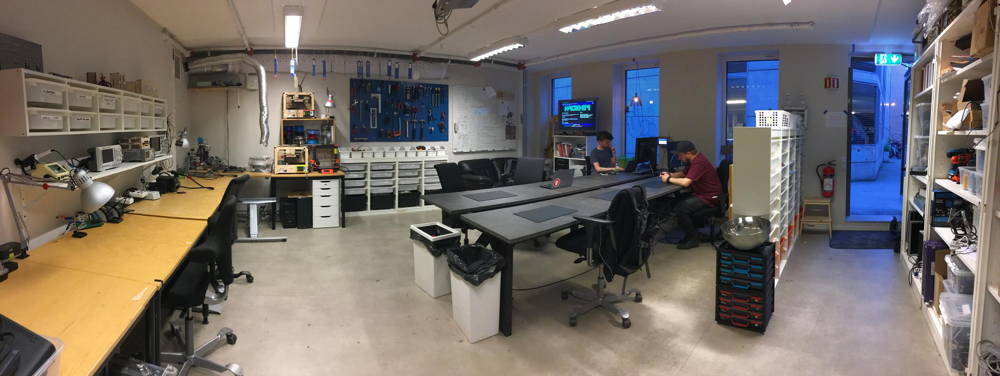

#Om Hackheim

__Hackheim er et Makerspace i Trondheim, stiftet i 2012 av kreative ildsjeler som ønsket en samlingsplass for likesinnede.__

Vi er åpne for alle uansett hva slags bakgrunn du kommer fra så kom innom om du er interessert i f.eks. 3D-printing, elektronikk, laserskjæring, programmering eller lignende, vi har åpne dager hver onsdag og søndag fra 18:00 og da er det bare å komme innom å si hei!

I våre lokaler er det tilgang til utstyr som f.eks. 3D printere, laserkutter, loddestasjoner og mer. Her kan du jobbe med egne prosjekter i et sosialt miljø og dele kunnskap med likesinnede.

## Et «hackerspace» hva er det?

Et hackerspace kjennetegnes av medlemmer som kommer sammen for å arbeide med hobbyprosjekter, både hardware- og softwarebasert. Motivasjonen for arbeidet er lysten til å lære noe nytt, lage noe nyttig, eller rett og slett fordi det er tøft! Gjennomføringen er preget av gjør-det-selv-løsninger og nysgjerrighet.

Denne subkulturen har vokst frem rundt høyere utdanningsinstitusjoner i USA og på kontinentet, men har hittil ikke hatt stort gjennomslag her hjemme. Det sentrale i denne typen forening er det å skape noe sammen andre, sosialisere og utveksle kunnskap; det er også vanlig å referere til makermiljøet like gjerne som hackermiljøet.

Det er på høy tid at teknologibyen Trondheim også får sitt eget hackerspace og her ønsker da Hackheim å fylle tomrommet!

## Hvem er vi?

Hackheim var en idè som oppstod blant en gruppe ildsjeler i juni 2012. Etter mye aktivitet på Facebook og via jungeltelegrafen samlet det seg en gjeng på Kiegelkroa en lørdag ettermiddag for idemyldring og noe godt å drikke. Dette var den spede start for Hackheim og siden den gang har vi fått oss romslige lokaler, nye medlemmer, sponsorer og støttespillere som har gjort det mulig for oss å vise oss fram på Pstereo pikniken og Toppledermøte under Kreator på NTNU.

Det eksisterer allerede liknende miljøer i Trondheim men da under linjeforeninger og studentklubber, hver og en gjerne med fokus på et område, det som er forskjellen mellom institusjoner som Omega verksed, Elektra og lignende, og oss er at vi ønsker å samle alle teknologiinteresserte under et tak for å utveksle kunnskap og inspirasjon på tvers av fagområder.

## Hvem er Hackheim for?

Kort og godt; Alle!

Vi bryr oss ikke om utdanning, alder, kjønn eller etnisitet. Vi er her for å være en samleplass for alle teknologiinteresserte.

Så om du er nysgjerrig besøk oss og om du har sansen for oss setter vi stor pris på dugnadsinnsats, innspill, deltakelse på spennende prosjekter og et aktivt medlemsskap.

Happy hacking!

